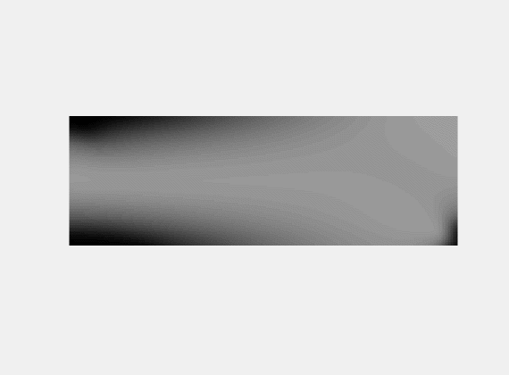

# EGP-preview-version
An Efficient Gradient Projection Method for Structural Topology Optimization (Preview Version)

## The MBB problem [(CODE)](./MBB_300_100_OUR.m):

## Force inverter mechanism [(CODE)](./MSE_SE_KO.m):

## 3D cantilever beam [(CODE)](./TO_3D_OUR.m):

